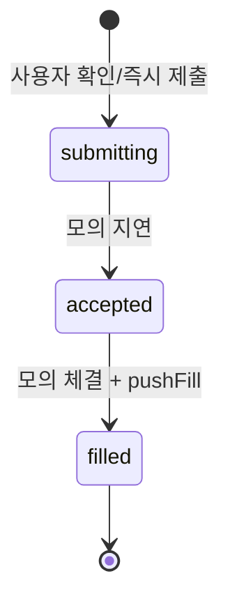

# 05-SpeedOrder — 아키텍처 개요

한국 HTS 속도감 + Toss식 단순 UI + Bitget형 선물 패널을 목표로 한 **공통 거래창 UI 엔진**입니다.  
지금은 **mock 데이터 + 주기적 시뮬레이션**만 사용하며, **실거래/실계좌 연결은 하지 않습니다.**

## 기술 스택

- React 19 + Vite 8 + TypeScript
- Tailwind CSS v4 (`@tailwindcss/vite`)
- Zustand (`src/store/tradingStore.ts` — 슬라이스 합성 + `src/store/slices/*`)
- 에러 바운더리 + `React.lazy` / `Suspense`로 패널/페이지 단위 격리

## 폴더 구조

```
src/
  components/
    orderbook/     OrderBookPanel
    speedorder/    SpeedOrderPanel, OrderConfirmModal
    position/      PositionPanel
    history/       TradeHistoryPanel
    chart/         ChartArea (TradingView 등 연결 슬롯)
    ticker/        TopTickerBar
    common/        ErrorBoundary, PanelShell
  layouts/         TradingLayout (반응형 그리드)
  pages/           TradingPage (패널 조합 + mock 실시간)
  symbols/         SYMBOL_REGISTRY, getSymbolSpec, STANDARD_SYMBOLS (+ `index.ts` barrel)
  vendor/          ORDER_EXECUTION_POLICY, engine status, market sync catalog, UTE snapshot readers
  services/
    websocket/     WebSocketClient 스텁 + 메시지 타입
    websocketService/  위 모듈 re-export (네이밍 통일용)
  domain/          공통 타입(OrderRequest, RiskSnapshot 등) — TGX/MockInvest/OneAI 재사용
  engine/          mockExecutionEngine, submitMockSpeedOrder 팩토리; `index.ts` 배럴 (UI에서 직접 호출 금지 권장)
  store/
    boot.ts        초기 심볼·호가·포지션 부트스트랩
    slices/        symbol+market, order, position, ui+risk 슬라이스
    selectors.ts   useShallow용 셀렉터
    tradingStoreTypes.ts  스토어 전체 타입(슬라이스 합성 계약)
    mockExecution.ts      엔진으로의 re-export (레거시 경로 호환)
  hooks/           useMockRealtime (mock tick)
  selftest/        runSpeedOrderSelfTest, speedOrderSelfTestCoreAdapter (@tetherget/self-test-core), feature flags, audit trail, UI store
  components/selftest/  SelfTestCenter, DiagnosticsPanel
  mock/            mockData, mockSimulate
  types/           trading, symbol
  utils/           safe*, format*, rounding, margin
```

## 컴포넌트 역할

| 컴포넌트 | 역할 |
|----------|------|
| **TopTickerBar** | 표준 심볼 틱 요약; 클릭 시 `setSymbol`. **선택 심볼을 맨 앞으로 재정렬**, 비선택은 `opacity`로 구분, `marketType` 표시. |
| **ChartArea** | 스토어 `symbol`·`lastPrice`·`getSymbolSpec` 표시; `data-chart-symbol`·루트 `key={symbol}`로 호스트 차트 위젯 연동·재마운트. |
| **OrderBookPanel** | `symbol`·`orderBook`·`lastPrice` 구독. `getSymbolSpec` 포맷·틱 밴드. 심볼 전환 시 본문 `key={symbol}`로 리셋. |
| **SpeedOrderPanel** | 제목·셀렉트에 `symbol` 반영, `setSymbol`. 확인 ON → **OrderConfirmModal**, OFF → 즉시 `submitMockSpeedOrder`. |
| **OrderConfirmModal** | 심볼·시장·방향·주문방식·가격·수량·예상 증거금(모의); **확인** 클릭 시에만 `submitMockSpeedOrder`. |
| **PositionPanel** | **현재 `symbol`과 일치하는 포지션만** 표시; 모의 청산 `closePositionDemo`. |
| **TradeHistoryPanel** | 체결 / 주문(`canceled` 제외) / 취소(`canceled`만) 탭 + 심볼 필터. 주문 상태 문자열은 모의 라이프사이클 그대로 표시. |
| **TradingLayout** | PC: 차트 + 우측 호가/주문열, 하단 포지션·내역. 모바일: 세로 스택. |
| **ErrorBoundary** | 패널 단위 오류 시 해당 영역만 대체 UI. 루트 `App`에도 동일 패턴. |

## 심볼 시스템 (표준)

- **목록**: `BTCUSDT`, `ETHUSDT`, `SOLUSDT`, `NASDAQ`, `GOLD` — `symbols/registry.ts`의 `SYMBOL_REGISTRY` / `STANDARD_SYMBOLS`
- **메타** (`SymbolSpec`): `marketType` (`crypto` \| `futures` \| `index` \| `commodity`), `tickSize`, `lotSize`, `priceDecimals`, `qtyDecimals`, `defaultLeverage`, `referencePrice`
- **조회**: `getSymbolSpec(symbol)` — 미등록 심볼은 BTC 메타를 복제한 fallback (안전 기본값)
- **호가 생성**: `mock/mockData.buildOrderBook(lastPrice, spec)` — 틱 간격에 `tickSize` 반영
- **주문 반올림**: `utils/rounding.ts`의 `roundToTickSize`, `roundToLotSize` (양수 수량이 lot 미만이면 최소 1 lot)
- **모의 증거금**: `utils/margin.ts` — `|가격×수량| / defaultLeverage`

`TickerRow`에 `marketType`이 포함되어 티커 바와 스토어가 동일 스키마를 유지합니다.

## 심볼 변경 시 UI 동기 (`setSymbol`)

`tradingStore.setSymbol`이 호출되면 (티커 클릭·주문창 셀렉트 등):

| 영역 | 동작 |
|------|------|
| **스토어** | `symbol`, 해당 티커의 `lastPrice`(없으면 `referencePrice`), `buildOrderBook(last, spec)`로 `orderBook` 갱신 |
| **호가** | 위 `orderBook` + `getSymbolSpec(symbol)`로 표시; 패널 제목·내부 `key={symbol}` |
| **티커 바** | 선택 심볼 행을 **맨 앞**으로 재정렬, 비선택 행은 시각적으로 약화 |
| **차트 슬롯** | 제목·본문·`data-chart-symbol`이 현재 심볼·가격·`marketType`과 동기; `key={symbol}`로 심볼 전환 시 위젯 재바인딩 용이 |
| **포지션** | `positions` 중 `p.symbol === symbol`인 행만 표시 |
| **주문** | `submitMockSpeedOrder`는 항상 스토어의 `symbol`을 주문 심볼로 사용 |

거래 내역은 **수동 심볼 필터**만 제공합니다(전체/다른 심볼 조회 유지).

## 주문 확인 모달 (`OrderConfirmModal`)

- **표시 조건**: `confirmOrders === true`이고 롱/숏(또는 초보자 빠른 매수) 클릭 시.
- **내용**: 심볼·`marketType`·방향(롱/숏)·시장가/지정가·가격(시장가는 참고가 문구)·수량·**예상 증거금**(`estimateInitialMarginUsdt`, 모의).
- **확인**: `submitMockSpeedOrder` 호출 → 아래 **주문 상태 흐름** 진행.
- **취소**: 모달만 닫음, 주문 없음.
- **확인 OFF**: 모달 없이 곧바로 `submitMockSpeedOrder` (동일 파이프라인).

## 주문 상태 흐름 (mock)



- 저장 행에는 `idle`이 들어가지 않습니다(`MockOrderStatus` 타입상 존재, UI/초기 개념용).
- 타입 전체: `idle` \| `submitting` \| `accepted` \| `filled` \| `canceled` \| `rejected` (`types/trading.ts`의 `MockOrderStatus` / `PersistedMockOrderStatus`).
- `canceled` / `rejected`는 목업 행·`cancelOrder` 등으로만 등장; 제출 시뮬레이션 기본 경로는 **성공 체결**만 수행합니다.

## 상태 관리 (Zustand)

- 단일 스토어: `useTradingStore`
- 도메인 필드: `symbol`, `lastPrice`, `orderBook`, `tickers`, `positions`, `fills`, `orders`
- UI 필드: `beginnerMode`, `confirmOrders`, **`mockOrderInFlightId`**, **`riskSnapshot`** (모의 사용 증거금 등 — `mergeRiskSnapshotWithPositions`로 포지션 변경 시 동기)
- **외부 데이터 주입용 액션** (WebSocket / 호스트 앱이 호출):
  - `applyOrderBook`, `applyLastPrice`, `applyTickers`, `patchTicker`
  - `setPositions`, `pushFill`, `upsertOrder`, `cancelOrder`, `setSymbol`
  - `setRiskSnapshot` — 호스트가 가용 잔고·한도를 주입 (WS/REST)
- **mock 전용**: `applyMockTick` — `useMockRealtime`이 `simulateTick(activeSymbol, …)` 후 호출해 호가·티커·미실현 손익 갱신

구체적인 상태 전이·타입 설명은 위 **「주문 상태 흐름 (mock)」** 절을 참고하세요. 구현: **`createSubmitMockSpeedOrder`** (`engine/submitMockSpeedOrder.ts`)가 스토어 `StoreApi`에 바인딩되고, 앱에서는 **`submitMockSpeedOrder`** (`store/tradingStore.ts` re-export)로 호출 — **실거래·실 API 호출 없음.**

## mock 실시간 갱신

- `hooks/useMockRealtime.ts` → `simulateTick(store.symbol, lastPrice, tickers)` — 활성 심볼 호가만 해당 `SymbolSpec`으로 재생성, 동명 티커 가격은 `lastPrice`와 동기. 인터벌은 **450ms ~ 5000ms**로 클램프되어 과도한 틱을 방지합니다.
- 프로덕션에서는 이 훅을 제거하고, 동일한 스토어 액션을 **WebSocket 핸들러**에서 호출하면 됩니다.

## Self-Test (mock diagnostics)

- **UI**: 좌하단 `Self-Test` → Self-Test Center (PASS/WARN/FAIL, issue count, last checked, Mock only 배지).
- **코드**: `src/selftest/` — websocket/실거래 없이 스토어·vendor·플래그 검증. Audit trail는 **`@tetherget/mock-audit-core`** (`auditTrail.ts`, max 500 ring)으로 filter/export/trim 공통화(Phase **3-D**); `DiagnosticsPanel`·`SelfTestAuditEntry` 필드는 동일.
- **CI/로컬**: `npm run smoke` — FAIL 시 exit 1. 상세는 [docs/SELF_TEST.md](docs/SELF_TEST.md).

## WebSocket 연결 포인트

1. **`services/websocket/WebSocketClient.ts`**  
   - `connect(url)`, `disconnect`, `subscribe` 스텁  
   - `onMessage(handler)`로 수신 → JSON 파싱 후 등록된 핸들러에 전달 (핸들러 내부 try/catch로 연쇄 오류 차단)

2. **권장 매핑 (수신 → 스토어)**  

   | 메시지 채널 (예시) | 스토어 액션 |
   |--------------------|-------------|
   | ticker 스냅샷 | `applyTickers` 또는 `patchTicker` |
   | orderbook 스냅샷 | `applyOrderBook` |
   | last / mark | `applyLastPrice` (+ 필요 시 호가 재빌드는 서버 데이터 우선) |
   | positions | `setPositions` |
   | fills | `pushFill` |
   | orders | `upsertOrder` / `cancelOrder` |

3. **호스트 앱 부트스트랩 예시 (의사코드)**

```ts
const client = new WebSocketClient(import.meta.env.VITE_WS_URL)
const unsub = client.onMessage((msg) => {
  if (msg.channel === 'orderbook') {
    useTradingStore.getState().applyOrderBook(msg.payload as OrderBookSnapshot)
  }
  // ...
})
client.connect()
```

실제 `WsInboundMessage` 형식은 거래소/내부 게이트웨이에 맞게 확장하면 됩니다.

## 02-TGX-CEX / 04-MockInvest / OneAI 연결 방법

### 공통 원칙

- **스토어 단일 소스**: `useTradingStore`의 `symbol`·`lastPrice`·`orderBook`·`positions`·`orders`·`fills`를 UI와 동기. 호스트는 이 필드를 WS/REST로만 갱신하면 컴포넌트 수정을 최소화합니다.
- **mock 유지**: 개발 시 `useMockRealtime` + `submitMockSpeedOrder` 그대로 두고, 통합 단계에서만 교체합니다.

### TGX-CEX (실거래/실시간 CEX 쪽) 연동 절차

1. **번들**: `05-SpeedOrder`를 workspace 패키지로 두고 TGX 앱에서 `TradingPage`(또는 개별 패널) import.  
2. **심볼 라우트**: TGX 라우트 파라미터(`:pair`) 변경 시 `useTradingStore.getState().setSymbol(normalized)` 호출 — 호가·티커·차트 슬롯·포지션 필터가 자동 동기됩니다.  
3. **시세·호가 WS**: 수신 시 `applyTickers` / `applyOrderBook` / `applyLastPrice`를 호출. `applyMockTick`은 제거하거나 플래그로 비활성화.  
4. **주문 REST/WS**: `submitMockSpeedOrder`(또는 `createSubmitMockSpeedOrder(커스텀Store)`) 대신 거래소 주문 API 호출 → 응답·체결 푸시에 맞춰 `upsertOrder`(상태 전이) 및 `pushFill`을 동일 스키마로 반영.  
5. **차트**: `ChartArea` 내부에 TradingView `widget`을 마운트하고 `data-chart-symbol` 또는 `useTradingStore(s => s.symbol)` 구독으로 `setSymbol`/`chart.setSymbol`을 연결.

### MockInvest (모의투자) 연동 절차

1. TGX와 동일하게 **스토어 주입**만 맞추면 UI는 재사용됩니다.  
2. **주문**: `submitMockSpeedOrder`를 MockInvest 백엔드의 **모의 주문 API**로 바꾸되, 응답으로 `submitting → accepted → filled`(또는 `rejected`)를 `upsertOrder`에 재현합니다. 동일 스토어에 `createSubmitMockSpeedOrder`를 바인딩하면 호스트 전용 Zustand와도 연결 가능합니다.  
3. **포지션/손익**: 서버가 계산한 `positions`를 `setPositions`로 밀어 넣으면 `PositionPanel`은 이미 `symbol` 필터만 적용합니다.  
4. **실거래 금지 모드**: MockInvest 빌드에서는 주문 클라이언트를 모의 엔드포인트에만 바인딩하고, `WebSocketClient`의 URL을 스테이징으로 제한합니다.

### OneAI 투자 플랫폼 (추후)

- **에이전트/추천 심볼**이 나오면 `setSymbol` + 짧은 설명 토스트를 호스트에서 처리하고, 거래창은 동일 스토어를 구독합니다.  
- **자동 주문**이 필요하면 `submitMockSpeedOrder`와 동일 시그니처의 어댑터 함수를 두고, 사람 확인 모달은 호스트 정책에 따라 `confirmOrders`를 끄거나 커스텀 모달로 교체합니다.

### 레거시 요약

1. **패키지화** (권장): `src`를 npm workspace 패키지 `@tetherget/speed-order-ui` 등으로 분리하고, 각 앱에서 import.  
2. **모노레포 복사/공유**: `components`·`store`·`types`를 공용 경로로 두고 Vite alias로 참조.  
3. **연결 시 교체 지점**  
   - `useMockRealtime` 제거 → WebSocket 부트스트랩으로 대체  
   - `submitMockSpeedOrder` 자리에 호스트의 **주문 API**를 두고, 응답/WS에 맞춰 동일한 `upsertOrder` / `pushFill` 상태 전이를 재현  
   - `ChartArea` → TradingView `container` 또는 자체 차트 루트로 교체  
   - `MOCK_SYMBOL` / `setSymbol`을 라우팅·심볼 선택기와 동기화  

실거래 연결 시에도 **스토어 액션 경계**를 유지하면 UI 컴포넌트 수정을 최소화할 수 있습니다.

## 2026 엔진 계층·스토어 모듈화

### 엔진 계층 (`src/engine/`)

| 모듈 | 역할 |
|------|------|
| **`mockExecutionEngine.ts`** | 순수 함수: 평단·미실현·실현(청산)·부분청산·반전·`revaluePositions`, **`executeNetSpeedFill`** / **`applyFillToPosition`**. NaN·0 이하 가격/수량은 조기 반환. |
| **`submitMockSpeedOrder.ts`** | `StoreApi<TradingStore>`를 받아 **`createSubmitMockSpeedOrder`**로 UI와 분리된 mock 제출 파이프라인(지연 → 체결 → `mergeRiskSnapshotWithPositions`). |

UI 컴포넌트는 **`submitMockSpeedOrder`만** 호출하고, 엔진 파일을 직접 import하지 않는 것을 권장합니다(테스트·호스트 어댑터는 엔진 직접 import 가능).

### Zustand 슬라이스 (`src/store/slices/`)

| 슬라이스 | 상태·액션 |
|----------|-----------|
| **symbolMarket** | `symbol`, `lastPrice`, `orderBook`, `tickers`, `setSymbol`, `apply*`, `applyMockTick` — 포지션 재평가 시 `riskSnapshot` 동기 |
| **order** | `orders`, `fills`, `mockOrderInFlightId`, `pushFill`, `upsertOrder`, `cancelOrder`, `setMockOrderInFlight` |
| **position** | `positions`, `setPositions`, `closePositionDemo` |
| **uiRisk** | `beginnerMode`, `confirmOrders`, `riskSnapshot`, `setRiskSnapshot` 등 |

`tradingStoreTypes.ts`에 전체 `TradingStore` 타입을 한곳에 두어 슬라이스가 동일 계약을 공유합니다.

### 조건·복합 주문 확장 계획

- **타입**: `src/domain/order.ts`의 `ConditionalOrderType` (`STOP`, `STOP_LIMIT`, `MIT`, `OCO`, `TP_SL` 등) 및 `OrderMode` (`standard` \| `speed` \| `hts` \| `conditional`).
- **실행**: 현재는 스피드 패널의 `market` / `limit`만 mock 체결. 향후 각 모드별 패널이 동일 스토어 액션을 호출하고, 엔진에 **조건부 트리거 큐**(가격 크로스 시 `executeNetSpeedFill` 호출)를 추가하는 형태로 확장합니다.
- **UX 슬롯**: 일반 / 스피드 / HTS / 조건 / 원클릭 청산 / 포지션 기반 CTA / 모바일 브레이크포인트는 레이아웃·패널 조합으로 수용 가능하도록 패널 단위 분리를 유지합니다.

### TGX-CEX / MockInvest / OneAI (엔진 관점 요약)

- **TGX-CEX**: 실시간은 WS → `applyMockTick` 대신 세분화된 액션 호출. 주문은 REST/WS 응답을 `upsertOrder`/`pushFill`로 매핑하거나, 로컬 체결 시뮬이 필요하면 **`executeNetSpeedFill`**만 호출해 포지션 일관성을 맞춥니다.
- **MockInvest**: 서버 권위 포지션이면 `setPositions` + `setRiskSnapshot`으로 밀고, 로컬 mock이면 현재 엔진 경로 유지.
- **OneAI**: 에이전트 출력 → `setSymbol` / `setRiskSnapshot` / 커스텀 `createSubmitMockSpeedOrder(aiAwareStore)`로 정책 레이어를 끼웁니다.

## 오류·성능 관련 결정

- 배열/숫자: `utils/safe.ts`, 스토어 `safeArray`로 **undefined 방지**; 호가 패널은 **빈 오더북** 시 안내 문구; `safeNumber`로 표시가 NaN일 때 레퍼런스가로 대체
- 셀렉터: `store/selectors.ts` + `useShallow`로 다중 필드 구독 시 **리렌더 감소** (예: `SpeedOrderPanel`)
- 패널마다 `ErrorBoundary` → 한 패널이 터져도 나머지 레이아웃 유지
- 차트 슬롯은 `lazy` + `Suspense`로 **코드 분할** 가능한 형태 유지

## 스크립트

- `npm run dev` — 로컬 개발
- `npm run build` — 타입체크 + 프로덕션 빌드
- `npm run lint` — ESLint
