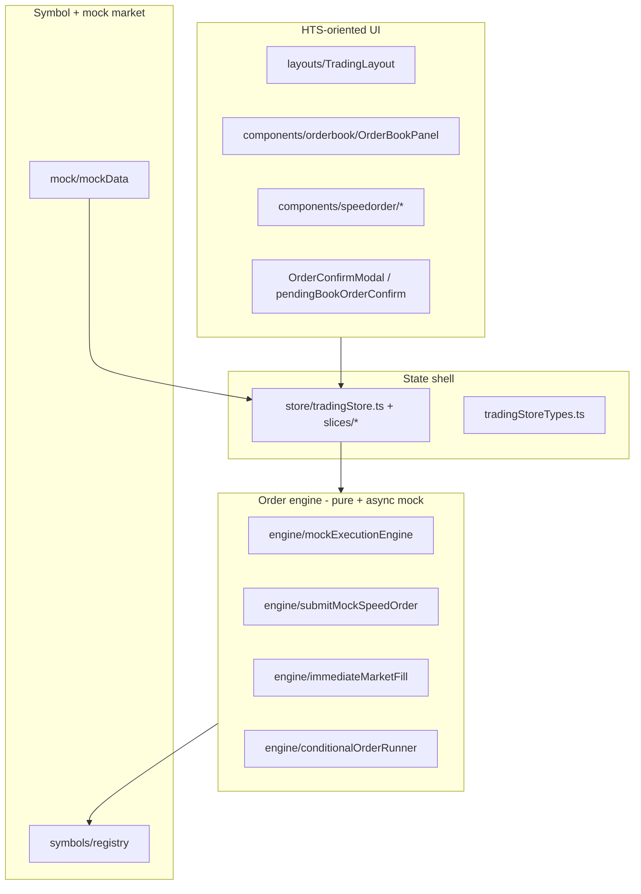

# HTS-Compatible Engine Structure

**HTS** (Home Trading System) in this project refers to **Korean professional trading UX patterns**: fast order entry, bid/ask color semantics, optional confirmation modals, dense order book, and responsive multi-panel layouts — **not** a proprietary binary protocol.

The **implementation structure** intentionally separates **HTS-shaped UI** from the **order engine** so the engine stays reusable and testable.

## Layer diagram

## Folder roles (preserved architecture)

| Path | HTS relevance | Engine relevance |
|------|----------------|------------------|
| `layouts/TradingLayout.tsx` | Wide grid: chart + order column + lower strip — classic HTS density on desktop. | Subscribes to store only. |
| `components/orderbook/` | Depth ladder, one-click/double-click, Korean color invert preset. | Calls `executeImmediateMockMarketOrder` / confirm flow; no fill math inline. |
| `components/speedorder/` | Speed buttons, MIT/STOP entry, confirm modal. | Invokes `submitMockSpeedOrder` (store-bound). |
| `store/slices/symbolMarketSlice.ts` | Symbol switch refreshes book like changing 종목. | Owns `setSymbol`, `applyLastPrice`, `applyMockTick`, conditional tick hookup. |
| `store/slices/positionSlice.ts` | Panel shows net/hedge positions. | Uses `revaluePositions` / demo close helpers. |
| `engine/*` | N/A (no DOM). | **All** net/hedge fill, fee estimate, conditional fills. |

## HTS-specific state hooks (mock)

From `TradingStoreState` (`tradingStoreTypes.ts`):

- `confirmOrders` + **`OrderConfirmModal`**: HTS-style deliberate confirm before fire.
- `pendingBookOrderConfirm`: double-click from book → confirm modal pipeline.
- `orderBookColorInvert` + presets (`orderBookDesignPresets.ts`): Korean bid/ask color convention without forking components.
- `cryptoPositionMode`: one-way vs hedge — matches pro futures terminals.

## Why this stays “HTS-compatible” without locking to one broker

- **Engine math** depends only on `SymbolSpec` + numeric inputs — no HTS vendor IDs.
- **UI** can be rearranged (panels) while **`TradingStore`** remains the adapter boundary.
- **Mock** simulates latency and status transitions so HTS-like UX can be tested without a backend.

## Stability guidelines

- Do **not** move fill logic into React components — breaks vendor reuse and unit testing.
- New HTS features (e.g. additional order types) should extend **`types/trading.ts`** and **`conditionalOrderRunner` / submit path** in `engine/`, then wire thin actions in slices.

## Related documents

- [ORDER_ENGINE.md](./ORDER_ENGINE.md) — engine API reference.
- [MARKET_SYNC.md](./MARKET_SYNC.md) — symbol and tick synchronization.
- [VENDOR_SYNC.md](./VENDOR_SYNC.md) — embedding rules.
