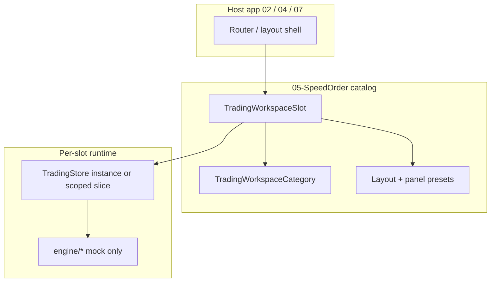

# Trading Workspace Categories (설계)

05-SpeedOrder에서 **자산군별 거래창**을 슬롯 단위로 분리·재사용하기 위한 모델입니다.  
**Mock/demo only** — 실거래 API, BrokerAdapter, WebSocket, polling 없음.

## 1. Dev port (확정)

| 항목 | 값 |
|------|-----|
| 이전 (미설정 시) | Vite 기본 `http://localhost:5173/` |
| **현재** | `http://localhost:5105/` |
| 설정 | `vite.config.ts` → `server.port: 5105`, `strictPort: true` |
| 5105 고정 가능 여부 | **가능** — monorepo 내 다른 앱과 충돌 없음 (2026-05 기준) |

`strictPort: true`이면 5105가 점유 중일 때 다른 포트로 넘어가지 않고 실패합니다. CI/문서·북마크 URL이 흔들리지 않습니다.

---

## 2. 개념 계층



| 계층 | 역할 |
|------|------|
| **Category** | 상품군 라인 (국내선물, 해외선물, …) — 메뉴·권한·기본 프리셋 |
| **Slot** | 카테고리 안의 N번 거래창 (1~3) — 독립 workspaceId |
| **Preset** | 호가/주문/포지션 UI·엔진 플래그 묶음 |
| **Store** | 슬롯별 `symbol`, book, positions (호스트가 인스턴스 분리) |

기존 `TradingAssetCategory` (`stock` \| `futures` \| `crypto`)는 **엔진·PnL 라우팅**용으로 유지.  
Workspace **Category**는 **UX·호스트 메뉴**용 상위 분류입니다.

---

## 3. Trading workspace category 모델

```ts
/** HTS 메뉴 / 호스트 탭 — 5개 고정 (Phase W0) */
export type TradingWorkspaceCategoryId =
  | 'domestic_futures'   // 국내선물
  | 'overseas_futures'   // 해외선물
  | 'crypto'             // 코인
  | 'domestic_stock'     // 국내주식
  | 'us_stock'           // 미국주식

export type TradingWorkspaceCategory = {
  id: TradingWorkspaceCategoryId
  labelKo: string
  /** 슬롯 기본 개수 (확장 시 host 설정) */
  defaultSlotCount: 1 | 2 | 3
  /** registry 필터 힌트 — 실제 종목은 SYMBOL_REGISTRY + host allowlist */
  marketTypes: readonly MarketType[]
  defaultQuoteCurrencies?: readonly string[]
}
```

### Category ↔ 기존 타입 매핑

| Workspace category | `MarketType` (typical) | `TradingAssetCategory` (engine) |
|--------------------|------------------------|----------------------------------|
| domestic_futures | `futures`, `index` | `futures` |
| overseas_futures | `futures`, `commodity`, `forex` | `futures` |
| crypto | `crypto` | `crypto` |
| domestic_stock | `stock` | `stock` |
| us_stock | `stock` | `stock` |

`SymbolSpec` + `getSymbolSpec`는 변경하지 않고, 슬롯의 **allowlist**로 종목 집합을 제한합니다.

---

## 4. Workspace slot 모델

```ts
export type WorkspaceLayoutPresetId =
  | 'hts_standard'      // 차트 + 우측 호가/주문 + 하단 포지션/내역 (현 TradingLayout)
  | 'hts_compact'       // 모바일 스택
  | 'order_column_only' // 임베드용 좁은 열

export type OrderBookPresetId = OrderBookDesignPresetId // 기존 config 재사용
export type OrderFormPresetId = 'speed_standard' | 'speed_confirm' | 'stop_mit_tab'
export type PositionPanelPresetId = 'single_symbol' | 'all_symbols' | 'category_filtered'

export type TradingWorkspaceSlot = {
  /** 전역 유일 — 예: domestic_futures:1 */
  workspaceId: string
  categoryId: TradingWorkspaceCategoryId
  /** 카테고리 내 표시 순번 1..3 */
  slotIndex: 1 | 2 | 3
  labelKo: string // 예: "국내선물 1번 거래창"

  assetClass: TradingWorkspaceCategoryId // explicit copy for vendor JSON
  layoutPreset: WorkspaceLayoutPresetId
  orderBookPreset: OrderBookPresetId
  orderFormPreset: OrderFormPresetId
  positionPanelPreset: PositionPanelPresetId

  /** 기능 플래그 (mock) */
  stopMitLockEnabled: boolean
  positionCloseEnabled: boolean
  mockOnly: true

  /** 초기 심볼·표준 종목 풀 (optional) */
  initialSymbol?: string
  symbolAllowlist?: readonly string[]
}
```

### 슬롯 ID 규칙

```
workspaceId = `${categoryId}:${slotIndex}`
예: crypto:2 → "코인 2번 거래창"
```

### 카탈로그 (기본 3슬롯 × 5카테고리)

| categoryId | slot 1 | slot 2 | slot 3 |
|------------|--------|--------|--------|
| domestic_futures | 국내선물 1번 | 2번 | 3번 |
| overseas_futures | 해외선물 1번 | 2번 | 3번 |
| crypto | 코인 1번 | 2번 | 3번 |
| domestic_stock | 국내주식 1번 | 2번 | 3번 |
| us_stock | 미국주식 1번 | 2번 | 3번 |

구현 시 `src/config/tradingWorkspaceCatalog.ts`에 **선언적 배열**로 두고, 호스트는 `getWorkspaceSlot(id)`만 import.

---

## 5. 런타임 바인딩 (05 내부)

```ts
export type TradingWorkspaceRuntime = {
  slot: TradingWorkspaceSlot
  /** 슬롯별 store — Phase W2부터 createTradingStore() 팩토리 */
  store: TradingStoreApi
  featureFlags: Pick<
    SpeedOrderFeatureFlags,
    'stopMitPriceLockEnabled' | 'mockRealtime' | 'conditionalOrders'
  >
}
```

**Phase W1 (완료)**: `src/domain/tradingWorkspace.ts` + `tradingWorkspaceCatalog.ts` — 5×3 정적 카탈로그.  
**Phase W2 (완료)**: `WorkspaceLauncher` + `?workspaceId=` + `activateWorkspace` preset wiring (단일 store).  
**Phase W3**: 슬롯마다 `createTradingStore` 인스턴스 분리.  
**Phase W3**: 02/04/07가 catalog + `TradingWorkspaceHost` 래퍼로 임베드.

기존 주문 경로 유지: `submitMockSpeedOrder`, `registerConditionalOrder`, `conditionalOrderRunner`.

---

## 6. W2 구현 (완료)

| 항목 | 경로 / 동작 |
|------|-------------|
| Launcher UI | `src/components/workspace/WorkspaceLauncher.tsx` |
| URL | `src/workspace/tradingWorkspaceUrl.ts` — `?workspaceId=`, fallback `domestic_futures:1` |
| Preset apply | `src/workspace/applyWorkspaceSlot.ts` + `workspaceUiSlice` |
| Popstate | `src/hooks/useWorkspaceUrlSync.ts` |
| Layout | `TradingLayout` `layoutPreset` prop |
| Order form tab | `RightOrderColumn` ← `workspaceOrderFormTab` |
| Position filter | `PositionPanel` ← `workspacePositionPanelPreset` |

Dev URL 예: `http://localhost:5105/?workspaceId=crypto:1`

---

## 6b. W1 구현 (완료)

| Export | 경로 |
|--------|------|
| Types | `src/domain/tradingWorkspace.ts` |
| Catalog + API | `src/domain/tradingWorkspaceCatalog.ts` |
| Barrel | `src/domain/index.ts` |

```ts
import {
  listTradingWorkspaceSlots,
  getTradingWorkspaceSlot,
  validateTradingWorkspaceCatalog,
} from '05-SpeedOrder/src/domain'
```

Self-test: `workspace-catalog-complete`, `workspace-id-unique`, `workspace-mock-only`, `workspace-category-slot-count`.  
Diagnostics: **Workspace** 탭 — categories 5, slots 15, invalid 0.

---

## 6b. 파일 배치 (W2+ 예정)

```
src/
  domain/
    tradingWorkspace.ts          # ✅ W1
    tradingWorkspaceCatalog.ts   # ✅ W1
  workspace/
    resolveWorkspaceSlot.ts
    TradingWorkspaceShell.tsx    # layout + preset 적용
  vendor/
    readWorkspaceVendorSnapshot.ts  # UTE용 직렬화
```

---

## 7. Phase별 구현 계획

| Phase | 내용 | 기존 기능 |
|-------|------|-----------|
| **W0** | 본 문서 + dev port 5105 + README | 변경 없음 |
| **W1** | ✅ 정적 카탈로그 15슬롯 + validate + self-test | 단일 TradingPage |
| **W2** | ✅ Launcher + URL + preset wiring | 단일 store, symbol/preset 반영 |
| **W3** | 슬롯별 `createTradingStore` 팩토리 | additive |
| **W4** | Vendor snapshot에 `workspaceId`, `assetClass` | TGX/MockInvest 문서 |
| **W5** | Host package export `TradingWorkspaceHost` | 02/04/07 통합 가이드 |

**금지 유지**: 실 API, BrokerAdapter, WS, polling, 기존 엔진 삭제.

---

## 8. Self-test / Diagnostics 계획

| Check ID | Phase | 검증 |
|----------|-------|------|
| `workspace-catalog-complete` | W1 ✅ | 5 categories × 3 slots = 15 entries |
| `workspace-id-unique` | W1 ✅ | workspaceId 중복 없음 |
| `workspace-mock-only` | W1 ✅ | 모든 slot `mockOnly === true` |
| `workspace-category-slot-count` | W1 ✅ | 카테고리당 3슬롯 |
| `workspace-preset-valid` | W2 | orderBookPreset이 registry에 존재 |
| `workspace-feature-flags` | W2 | stopMitLockEnabled / positionCloseEnabled 불리언 |
| `dev-port-5105` | W0 | smoke에서 `SPEED_ORDER_DEV_PORT=5105` 문서 상수 일치 (선택) |

Diagnostics (W1):

- 탭 **Workspace**: catalog 요약 + 15 `workspaceId` 목록

---

## 9. 02-CEX / 04-MockInvest / 07-UTE 재사용

호스트는 다음만 가져갑니다:

1. `TRADING_WORKSPACE_CATALOG` — 슬롯 메타
2. `TradingWorkspaceShell` — layout + panels
3. `createTradingStore(initialState?)` — 슬롯별 인스턴스
4. `readSpeedOrderVendorSerializableSnapshot(state)` — 기존 + `workspaceId`

주문·청산 의미론은 `src/domain` + `src/engine`에 유지; 호스트는 **슬롯 수·카테고리 메뉴**만 구성합니다.

---

## 10. 현재 앱과의 관계

- **지금**: `TradingPage` 1개, `symbol` 전역, `tradingAssetCategory(spec)`으로 세그먼트 라벨만 구분.
- **설계 후**: 동일 엔진, **슬롯 카탈로그**로 UX·프리셋·호스트 라우팅만 분리.

Stop/MIT price lock (`stopMitDraft`) · conditional orders · self-test는 슬롯 플래그 `stopMitLockEnabled`로 on/off 가능 (기본 `true`).
