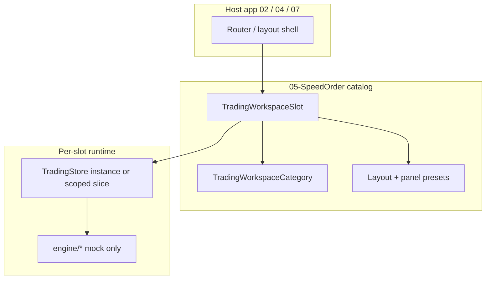

# Trading Workspace Categories (????)

05-SpeedOrder????? **???????? ??????*????? ???????????????????????????? ?????????  
**Mock/demo only** ???????API, BrokerAdapter, WebSocket, polling ????.

## 1. Dev port (????)

| ???? | ??|
|------|-----|
| ???? (???????? | Vite ?? `http://localhost:5173/` |
| **?????** | `http://localhost:5105/` |
| ???? | `vite.config.ts` ??`server.port: 5105`, `strictPort: true` |
| 5105 ??? ???????? | **????* ??monorepo ????? ??? ??? ???? (2026-05 ???) |

`strictPort: true`??? 5105?? ????? ??? ????? ???????????????? ??? ???????????? CI/??????????URL?????????? ??????????.

---

## 2. ????? ???



| ??? | ???? |
|------|------|
| **Category** | ?????????? (???????, ????????, ?? ???????????????? ?????|
| **Slot** | ?????? ???? N????????(1~3) ????? workspaceId |
| **Preset** | ????/??/??????UI????? ?????????? |
| **Store** | ?????`symbol`, book, positions (????????? ?????????? ???) |

?? `TradingAssetCategory` (`stock` \| `futures` \| `crypto`)??**?????PnL ???????*???????????.  
Workspace **Category**??**UX?????????????**??????? ???????????

---

## 3. Trading workspace category ??

```ts
/** HTS ????? / ???????????5????? (Phase W0) */
export type TradingWorkspaceCategoryId =
  | 'domestic_futures'   // ???????
  | 'overseas_futures'   // ????????
  | 'crypto'             // ???
  | 'domestic_stock'     // ????????
  | 'us_stock'           // ??????

export type TradingWorkspaceCategory = {
  id: TradingWorkspaceCategoryId
  labelKo: string
  /** ??? ?? ????? (????? ??host ????) */
  defaultSlotCount: 1 | 2 | 3
  /** registry ????? ????? ?????? ????? SYMBOL_REGISTRY + host allowlist */
  marketTypes: readonly MarketType[]
  defaultQuoteCurrencies?: readonly string[]
}
```

### Category ???? ????????

| Workspace category | `MarketType` (typical) | `TradingAssetCategory` (engine) |
|--------------------|------------------------|----------------------------------|
| domestic_futures | `futures`, `index` | `futures` |
| overseas_futures | `futures`, `commodity`, `forex` | `futures` |
| crypto | `crypto` | `crypto` |
| domestic_stock | `stock` | `stock` |
| us_stock | `stock` | `stock` |

`SymbolSpec` + `getSymbolSpec`?????????? ???, ?????**allowlist**????? ???????????????????

---

## 4. Workspace slot ??

```ts
export type WorkspaceLayoutPresetId =
  | 'hts_standard'      // ???? + ??? ????/?? + ????? ??????????? (??TradingLayout)
  | 'hts_compact'       // ??????????
  | 'order_column_only' // ???????? ??? ??

export type OrderBookPresetId = OrderBookDesignPresetId // ?? config ???????
export type OrderFormPresetId = 'speed_standard' | 'speed_confirm' | 'stop_mit_tab'
export type PositionPanelPresetId = 'single_symbol' | 'all_symbols' | 'category_filtered'

export type TradingWorkspaceSlot = {
  /** ????? ??? ???? domestic_futures:1 */
  workspaceId: string
  categoryId: TradingWorkspaceCategoryId
  /** ?????? ??????? ???? 1..3 */
  slotIndex: 1 | 2 | 3
  labelKo: string // ?? "??????? 1????????

  assetClass: TradingWorkspaceCategoryId // explicit copy for vendor JSON
  layoutPreset: WorkspaceLayoutPresetId
  orderBookPreset: OrderBookPresetId
  orderFormPreset: OrderFormPresetId
  positionPanelPreset: PositionPanelPresetId

  /** ???? ???????(mock) */
  stopMitLockEnabled: boolean
  positionCloseEnabled: boolean
  mockOnly: true

  /** ??? ???????? ??? ?? (optional) */
  initialSymbol?: string
  symbolAllowlist?: readonly string[]
}
```

### ??? ID ????

```
workspaceId = `${categoryId}:${slotIndex}`
?? crypto:2 ??"??? 2????????
```

### ??????? (?? 3??? ?? 5??????)

| categoryId | slot 1 | slot 2 | slot 3 |
|------------|--------|--------|--------|
| domestic_futures | ??????? 1??| 2??| 3??|
| overseas_futures | ???????? 1??| 2??| 3??|
| crypto | ??? 1??| 2??| 3??|
| domestic_stock | ???????? 1??| 2??| 3??|
| us_stock | ?????? 1??| 2??| 3??|

???? ??`src/config/tradingWorkspaceCatalog.ts`??**???????????**?????, ?????????? `getWorkspaceSlot(id)`??import.

---

## 5. ???????????(05 ????)

```ts
export type TradingWorkspaceRuntime = {
  slot: TradingWorkspaceSlot
  /** ?????store ??Phase W2????createTradingStore() ???????*/
  store: TradingStoreApi
  featureFlags: Pick<
    SpeedOrderFeatureFlags,
    'stopMitPriceLockEnabled' | 'mockRealtime' | 'conditionalOrders'
  >
}
```

**Phase W1 (????)**: `src/domain/tradingWorkspace.ts` + `tradingWorkspaceCatalog.ts` ??5??3 ??? ???????.  
**Phase W2 (????)**: `WorkspaceLauncher` + `?workspaceId=` + `activateWorkspace` preset wiring (??? store).  
**Phase W3 (????)**: ???????? `createTradingStore` ?????????? ???.  
**Phase W4 (????)**: workspace??vendor snapshot export.  
**Phase W5 (????)**: `TradingWorkspaceHost` embed export (`src/workspace`).

?? ?? ??? ????: `submitMockSpeedOrder`, `registerConditionalOrder`, `conditionalOrderRunner`.

---

## 6. W2 ???? (????)

| ???? | ??? / ????? |
|------|-------------|
| Launcher UI | `src/components/workspace/WorkspaceLauncher.tsx` |
| URL | `src/workspace/tradingWorkspaceUrl.ts` ??`?workspaceId=`, fallback `domestic_futures:1` |
| Preset apply | `src/workspace/applyWorkspaceSlot.ts` + per-workspace `workspaceRuntimeSlice` |
| W3 store registry | `src/store/workspaceStoreRegistry.ts` ? `createTradingStore(workspaceId)` |
| W3 shell (active id / URL) | `src/store/workspaceShellStore.ts` ? `workspaceShellSlice` |
| W3 trading hook (fallback API) | `src/store/tradingStore.ts` ??`useTradingStore` proxies active registry store |
| Popstate | `src/hooks/useWorkspaceUrlSync.ts` |
| Layout | `TradingLayout` `layoutPreset` prop |
| Order form tab | `RightOrderColumn` ??`workspaceOrderFormTab` |
| Position filter | `PositionPanel` ??`workspacePositionPanelPreset` |

Dev URL ?? `http://localhost:5105/?workspaceId=crypto:1`

---

## 6b. W1 ???? (????)

| Export | ??? |
|--------|------|
| Types | `src/domain/tradingWorkspace.ts` |
| Catalog + API | `src/domain/tradingWorkspaceCatalog.ts` |
| Barrel | `src/domain/index.ts` |

```ts
import {
  listTradingWorkspaceSlots,
  getTradingWorkspaceSlot,
  validateTradingWorkspaceCatalog,
} from '05-SpeedOrder/src/domain'
```

Self-test: `workspace-catalog-complete`, `workspace-id-unique`, `workspace-mock-only`, `workspace-category-slot-count`.  
Diagnostics: **Workspace** ????categories 5, slots 15, invalid 0.

---

## 6b. ??? ??? (W2+ ????)

```
src/
  domain/
    tradingWorkspace.ts          # ??W1
    tradingWorkspaceCatalog.ts   # ??W1
  workspace/
    TradingWorkspaceHost.tsx     # ??W5 embed entry
    TradingWorkspaceHostProvider.tsx
    TradingWorkspaceHostView.tsx
    index.ts                     # host + vendor snapshot re-exports
  vendor/
    readWorkspaceVendorSnapshot.ts  # ??W4 UTE/???????????
```

---

## 6c. W4 ??Vendor snapshot export (????)

| API | ???? |
|-----|------|
| `readWorkspaceVendorSnapshot(workspaceId)` | ??? ??? ??registry ???????????? ??runtime ????? |
| `readAllWorkspaceVendorSnapshots()` | ??????? 15??? ??? (?????????? ???????live symbol/preset) |
| `readActiveWorkspaceVendorSnapshot()` | shell `activeWorkspaceId` ??? |
| `readSpeedOrderVendorSerializableSnapshot(state)` | **?? ????** ??????? trading state (breaking change ????) |

### `TradingWorkspaceVendorSnapshot` ?????

`workspaceId`, `categoryId`, `slotIndex`, `displayName`, `assetClass`, `activeSymbol`, `orderBookPreset`, `orderFormPreset`, `positionPanelPreset`, `layoutPreset`, `stopMitLockEnabled`, `positionCloseEnabled`, `mockOnly: true`

### Host contract ?????

```ts
import {
  readActiveWorkspaceVendorSnapshot,
  readAllWorkspaceVendorSnapshots,
  readSpeedOrderVendorSerializableSnapshot,
  useTradingStore,
} from '05-speedorder' // workspace alias

// Per-workspace HTS ???? (02-CEX ????? / 04-MockInvest ??? ????)
const activeWs = readActiveWorkspaceVendorSnapshot()
// activeWs?.workspaceId === 'crypto:1'
// activeWs?.mockOnly === true

const all = readAllWorkspaceVendorSnapshots()
// all.length === 15

// ?? UTE market sync (????? trading store ??????????)
const legacy = readSpeedOrderVendorSerializableSnapshot(useTradingStore.getState())
// legacy.marketSync.symbol === activeWs?.activeSymbol (????? ???????
```

Self-test: `workspace-vendor-active-snapshot`, `workspace-vendor-all-snapshots`, `workspace-vendor-contract-stable`, `workspace-vendor-mock-only`, `workspace-vendor-no-api-no-websocket`.

Diagnostics **Workspace** ?? active vendor snapshot, snapshot count, invalid count, `mockOnly=true`.

---

## 6d. W5 ??TradingWorkspaceHost export (????)

| Export | ??? |
|--------|------|
| Embed entry | `src/workspace/TradingWorkspaceHost.tsx` |
| Provider / hook | `TradingWorkspaceHostProvider.tsx`, `useTradingWorkspaceHost` |
| Core layout | `TradingWorkspaceHostView.tsx` (TradingLayout + panels) |
| Barrel | `src/workspace/index.ts` |

### Host props

| Prop | ?? | ???? |
|------|------|------|
| `initialWorkspaceId?` | URL ????? `domestic_futures:1` | shell bootstrap |
| `showLauncher?` | `true` | `WorkspaceLauncher` |
| `compact?` | `false` | ??????chrome |
| `onWorkspaceChange?` | ??| `(TradingWorkspaceVendorSnapshot) => void` |
| `renderHeaderSlot?` | ??| `{ activeSnapshot, allSnapshots }` |
| `mockOnly?` | `true` (?????) | `false` ??throw |
| `showHostDiagnostics?` | `false` | active snapshot strip |
| `enableUrlSync?` | `false` | standalone?? `true` |
| `enableMockRealtime?` | `true` | mock tick |

### Embed ?????

```tsx
import { TradingWorkspaceHost } from '05-speedorder/src/workspace'

export function CexTradingPane() {
  return (
    <TradingWorkspaceHost
      mockOnly
      initialWorkspaceId="crypto:1"
      showLauncher
      showHostDiagnostics
      onWorkspaceChange={(snap) => {
        console.log(snap.workspaceId, snap.activeSymbol, snap.mockOnly)
      }}
      renderHeaderSlot={({ allSnapshots }) => (
        <div>slots ready: {allSnapshots.length}</div>
      )}
    />
  )
}
```

Mount ??`readAllWorkspaceVendorSnapshots()` ??context `allSnapshots` (15).  
????? ??????`onWorkspaceChange(readActiveWorkspaceVendorSnapshot())`.

Standalone `TradingPage`????? Host + `enableUrlSync` + `SelfTestCenter` (?? ???????????).

Self-test: `workspace-host-export`, `workspace-host-initial-workspace`, `workspace-host-snapshot-callback`, `workspace-host-mock-only`, `workspace-host-no-api-no-websocket`.

---

## 7. Phase?????? ?????

| Phase | ????? | ?? ???? |
|-------|------|-----------|
| **W0** | ?????? + dev port 5105 + README | ???????? |
| **W1** | ????? ??????? 15??? + validate + self-test | ??? TradingPage |
| **W2** | ??Launcher + URL + preset wiring | ??? store, symbol/preset ????? |
| **W3** | ???????`createTradingStore` ???????| additive |
| **W4** | ??`TradingWorkspaceVendorSnapshot` + readers | TGX/MockInvest/UTE |
| **W5** | ??`TradingWorkspaceHost` + Provider/View | 02/04/07 embed |

**???? ????**: ??API, BrokerAdapter, WS, polling, ?? ???? ????.

---

## 8. Self-test / Diagnostics ?????

| Check ID | Phase | ????|
|----------|-------|------|
| `workspace-catalog-complete` | W1 ??| 5 categories ?? 3 slots = 15 entries |
| `workspace-id-unique` | W1 ??| workspaceId ??? ???? |
| `workspace-mock-only` | W1 ??| ???? slot `mockOnly === true` |
| `workspace-category-slot-count` | W1 ??| ????????3??? |
| `workspace-preset-valid` | W2 | orderBookPreset??registry?????? |
| `workspace-feature-flags` | W2 | stopMitLockEnabled / positionCloseEnabled ?????|
| `dev-port-5105` | W0 | smoke????? `SPEED_ORDER_DEV_PORT=5105` ???? ????? ???? (?????) |

Diagnostics (W1):

- ??**Workspace**: catalog ????? + 15 `workspaceId` ??

---

## 9. 02-CEX / 04-MockInvest / 07-UTE ???????

?????????? ?????????????????:

1. `TRADING_WORKSPACE_CATALOG` ????? ????
2. `TradingWorkspaceShell` ??layout + panels
3. `createTradingStore(initialState?)` ?????????????????
4. `readWorkspaceVendorSnapshot` / `readAllWorkspaceVendorSnapshots` ????? ???? + runtime
5. `readSpeedOrderVendorSerializableSnapshot(state)` ???? trading/market sync (????? ????)

??????? ??????? `src/domain` + `src/engine`??????; ?????????? **??? ??????????????**?????????????

---

## 10. ????? ?????????

- **????*: `TradingPage` 1?? `symbol` ?????, `tradingAssetCategory(spec)`???? ??????? ????????.
- **???? ??*: ??? ????, **??? ???????**??UX??????????????? ????????? ???.

Stop/MIT price lock (`stopMitDraft`) ? conditional orders ? self-test????? ???????`stopMitLockEnabled`??on/off ????(?? `true`).

---

## 11. Lightweight Research Feed panel (03-OneAI mock)

**Scope:** 05-SpeedOrder only. Displays a **mock** Signal Research Feed for future **03-OneAI** integration ? **no import from 03**, no HTTP, WebSocket, or polling.

| Item | Detail |
|------|--------|
| UI | `src/components/research/ResearchFeedPanel.tsx`, `ResearchFeedCard.tsx` |
| Data | `src/research/mockResearchFeedAdapter.ts` ? `readMockResearchFeedSnapshot({ symbol })` |
| Placement | Below order forms in `RightOrderColumn` (right column, under Speed/Stop-MIT tabs) |
| Feature flag | `SPEED_ORDER_FEATURE_FLAGS.enableResearchFeedPanel` (host alias: `speedorder.enableResearchFeedPanel`, default **true**) |

### Feed item fields

| Field | Type / notes |
|-------|----------------|
| `strategyType` | string |
| `direction` | `long` \| `short` \| `neutral` |
| `confidenceMock` | 0?100 (not live model output) |
| `marketType` | `crypto` \| `futures` \| `stock` \| `index` |
| `tags` | string[] |
| `reasoningSummary` | string |
| `marketRegimeRef` | string |

Snapshot: `{ items, mockOnly: true, source: 'mock_local_adapter' }`.

### Diagnostics (Workspace tab)

- `researchFeedPanelEnabled`
- `researchFeedItemCount`
- `researchFeedMockOnly`

### Self-test IDs

- `research-feed-panel-render`
- `research-feed-panel-schema`
- `research-feed-panel-mock-only`
- `research-feed-panel-no-api-no-websocket`

### Future 03 adapter

Replace `readMockResearchFeedSnapshot` with a host-injected adapter implementing the same `ResearchFeedSnapshot` / `ResearchFeedItem` types; keep UI and feature flag unchanged.

---

## 12. TGX-style Order Book (P1)

**Scope:** 05-SpeedOrder only. Adds a **TGX-style** order book UI (02-TGX-CEX reference) alongside the existing **legacy** `OrderBookPanel` ? legacy is **not removed**.

| Item | Detail |
|------|--------|
| Legacy UI | `src/components/orderbook/OrderBookPanel.tsx` (design presets, optional one-click) |
| TGX UI | `TgxOrderBookPanel.tsx`, `TgxOrderBookRow.tsx` |
| Host switch | `OrderBookHost.tsx` ? Legacy / TGX toggle when `enableTgxOrderBook` |
| Placement | `RightOrderColumn`: order book ? order tabs ? Speed/Stop-MIT ? Research feed |
| Feature flag | `SPEED_ORDER_FEATURE_FLAGS.enableTgxOrderBook` (alias: `speedorder.enableTgxOrderBook`, default **true**) |
| Store | `orderBookStyle`: `legacy` \| `tgx_style` (localStorage) |
| Row density | `orderBookRowDensity`: `compact` (10 rows) \| `dense` (12 rows) ? TGX panel toolbar |

### TGX P1 visuals (vs legacy)

- Tighter HTS rows, stronger bid/ask contrast (emerald-300 / rose-300)
- Hover row ring highlight; intent row (violet) + locked Stop/MIT trigger row (amber)
- Stronger cumulative depth gradient + quantity column mini-bar
- Compact column grid (Price / Size / Cum)
- **No one-click execution path** in TGX panel (badge: ??? OFF); shared store flags unchanged for legacy

### Click policy (unchanged semantics)

- Single click ? `orderBookPendingLimitPrice` + `orderBookPendingTriggerPrice` + highlight (intent only)
- Stop/MIT tab consumes pending trigger via `consumeOrderBookPendingTrigger()` ? `lockFromBook` (no `lastPrice` auto-follow)
- Double-click confirm still gated by `orderBookDoubleClickEnabled` (default off)

### Diagnostics (Workspace tab)

- `orderBookStyle` (effective: respects `enableTgxOrderBook`)
- `tgxOrderBookEnabled`
- `orderBookRowDensity` (+ display row count)

### Self-test IDs

- `tgx-orderbook-render`
- `tgx-orderbook-click-intent`
- `tgx-orderbook-stopmit-lock` (full check when smoke has store)
- `tgx-orderbook-mock-only`
- `tgx-orderbook-no-api-no-websocket`

### P2 ? TGX-style Order Form UX

| Item | Detail |
|------|--------|
| Intent strip | `OrderFormIntentStrip.tsx` ? under order tabs, above Speed/Stop-MIT panels |
| Tabs | `OrderFormTabs.tsx` ? violet limit hint (standard), amber trigger hint (Stop/MIT) |
| Rhythm | `tgxFormRhythm.ts` + `useTgxFormRhythm()` ? input height/spacing aligned to TGX row density |
| Policy badge | `One-click disabled ? intent only` when `orderBookStyle=tgx_style` |

**Intent strip fields:** limit intent, trigger intent, Stop/MIT locked price, source (??/??), unlock/clear actions.

**Diagnostics (Workspace tab):** `orderFormIntentVisible`, `stopMitLockVisible`, `oneClickPolicy`, `tgxFormRhythm`.

**Self-test IDs:** `tgx-orderform-intent-strip`, `tgx-orderform-stopmit-lock-visible`, `tgx-orderform-oneclick-disabled`, `tgx-orderform-no-api-no-websocket`.

### P3 ? Position Close UX (mock intent)

| Item | Detail |
|------|--------|
| Model | `src/domain/positionCloseIntent.ts` ? `PositionCloseIntent` with `mockOnly: true` |
| Store | `positionCloseSlice` ? intent, selection, confirm ? **audit/log only** (no `closePositionDemo` on confirm) |
| UI | `PositionPanel` + `CloseIntentStrip` + `PositionBatchCloseBar` + `PositionRowCloseActions` |
| Confirm | `OrderConfirmModal` flow `position_close` ? button "?? (mock log)" |

**Intent fields:** symbol, side, qty, ratio (25/50/80/100), orderType (market/limit), referencePrice, batchMode, positionIds.

**Batch modes:** selected, all, long_only, short_only ? no live execution.

**Diagnostics:** `closeIntentActive`, `closeIntentRatio`, `closeIntentOrderType`, `selectedPositionCount`, `mockCloseOnly`.

**Self-test IDs:** `position-close-intent-created`, `position-close-ratio-buttons`, `position-close-selected-batch`, `position-close-mock-only`, `position-close-no-api-no-websocket`.

### P4 recommendation (multi-symbol close / account risk)

- Cross-symbol close queue with per-symbol reference prices in one confirm sheet
- Account-level risk panel tying `riskSnapshot` to batch close caps (still mock-only)

