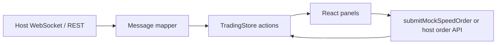

# Vendor-Safe Structure

This package is intended to ship as a **reusable trading UI + mock engine** inside larger products (e.g. TGX-CEX, MockInvest, internal UTE shells). Vendor safety means **clear boundaries**, **no hidden network I/O in core paths**, and **injectable state** so the host controls credentials, routing, and compliance.

## Principles

1. **No live trading in this repo**: mock delays, local fills, and stub WebSocket types only (`AGENTS.md`, `.cursorrules`).
2. **Engine is not a singleton service**: pure functions + Zustand `StoreApi<TradingStore>` factories (e.g. `createSubmitMockSpeedOrder(store)` in `submitMockSpeedOrder.ts`).
3. **Host owns transport**: `WebSocketClient` is a stub; the host swaps URL, auth, and `onMessage` → maps to store actions.
4. **Stable contracts**: `TradingStoreState` / actions in `tradingStoreTypes.ts` are the integration surface — prefer adding optional fields over breaking renames.

## Safe integration surfaces

| Surface | Use |
|---------|-----|
| **`src/vendor`** | **`ORDER_EXECUTION_POLICY`**, **`SPEED_ORDER_ENGINE_STATUS`**, **`MARKET_SYNC_ACTIONS`**, **`speedOrderSymbolRegistry`**, **`readSpeedOrderVendorSerializableSnapshot`**, **`getSpeedOrderVendorBundle`** — TGX/UTE-safe, no React |
| **`src/engine`** | Barrel re-export of mock engine + conditional runner + submit factory |
| **`src/symbols`** | Registry barrel for `SymbolSpec` resolution |
| Store actions | `setSymbol`, `applyMockTick`, `applyLastPrice`, `applyOrderBook`, `applyTickers`, `patchTicker`, `setRiskSnapshot`, `upsertOrder`, `pushFill`, `setPositions` |
| Engine exports | `executeSpeedOrderFill`, `revaluePositions`, `runConditionalOrdersOnTick` — for hosts that replay fills from paper/live adapters |
| Factories | `createSubmitMockSpeedOrder` — bind the same UI to a **different** Zustand store instance (multi-account or embedded panel) |
| Domain types | `src/domain/*`, `src/types/*` — shared DTOs without React |

## TGX-CEX sync rules

- **No sibling-folder imports**: TGX (02) must not reach into `05-SpeedOrder` via `../02-...` or similar; use workspace package name or configured path alias to **`05-SpeedOrder`** sources only.
- **Stable contracts**: prefer **`src/vendor`**, **`src/engine`**, **`src/symbols`**, and **`TradingStore`** actions over deep file paths that may move during refactors.
- **Mock default**: until a host replaces submission, `ORDER_EXECUTION_POLICY.mode` remains **`mock_demo`** with live flags **`false`**.

## What vendors should not do

- Import engine functions from UI components in duplicate “shadow” implementations — drift breaks position consistency.
- Assume **file system** or **env** secrets exist in `05-SpeedOrder` — they do not; keep keys in the host.
- Replace `SymbolSpec` with ad-hoc JSON that bypasses `mergeSymbolSpec` — you lose NaN guards and tick value defaults.

## Data flow (recommended)

For **demo** embeds: `useMockRealtime` → `applyMockTick`.

For **vendor live preview** (read-only): map depth and trades to `applyOrderBook` / `applyLastPrice` only; keep mock submit disabled or swap `submitMockSpeedOrder` for a no-op that calls host APIs.

## UTE / future compatibility

- Keep **symbol normalization** in one place (`getSymbolSpec`) so UTE’s instrument IDs map to the same string keys as TGX when shared.
- Risk snapshot is already designed for **host injection** (`setRiskSnapshot`, merged on position changes).

## Related documents

- [../MASTER_MANUAL.md](../MASTER_MANUAL.md) — operator + integrator index and changelog.
- [TGX_INTEGRATION.md](./TGX_INTEGRATION.md) — concrete host steps.
- [ORDER_ENGINE.md](./ORDER_ENGINE.md) — execution boundaries.
- [HTS_ENGINE_STRUCTURE.md](./HTS_ENGINE_STRUCTURE.md) — where UI ends and store begins.
